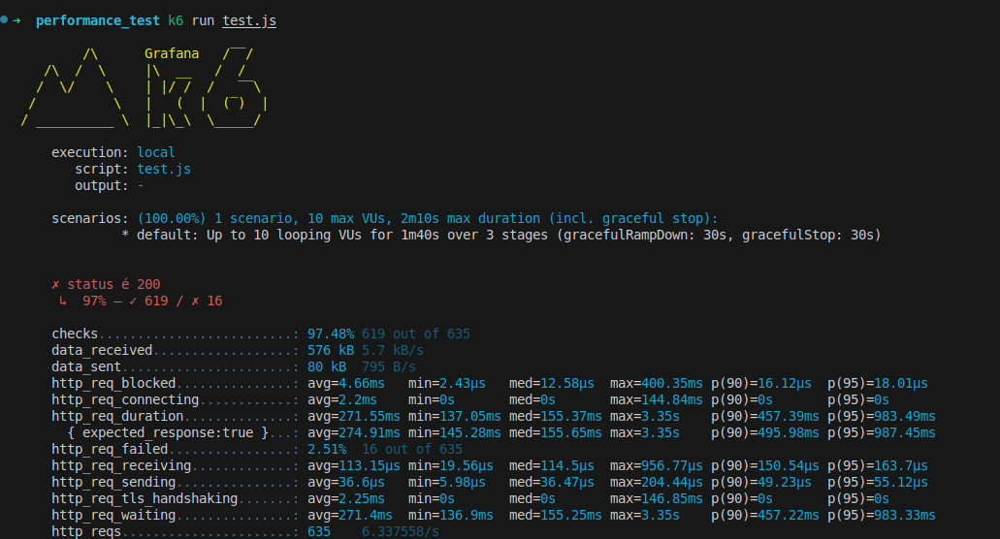
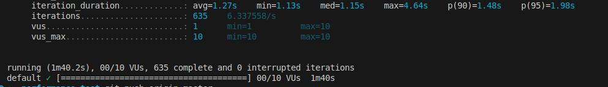

### Node usado: 
`20.18.0`

### Install linux
`sudo apt update`
 
`sudo apt install -y gnupg software-properties-common ca-certificates curl`
 
`curl -fsSL https://dl.k6.io/key.gpg | sudo gpg --dearmor -o /usr/share/keyrings/k6-archive-keyring.gpg`
 
`echo "deb [signed-by=/usr/share/keyrings/k6-archive-keyring.gpg] https://dl.k6.io/deb stable main" | sudo tee /etc/apt/sources.list.d/k6.list`
 
`sudo apt update`
 
`sudo apt install k6`

### Install Windows
`choco install k6`

### Install macOs
`brew install k6`

 

## Executar os testes

### Teste de carga(load)
`k6 run scripts/load_test.js`

### Teste de capacidade(capacity planning)
`k6 run scripts/capacity_planning.js`

### Teste de pico(spike test)
`k6 run scripts/spike_test.js`

### Teste de resiliencia
`k6 run scripts/resilience_test.js`

### Teste de stress
`k6 run scripts/stress_test.js`

 

### Monitoramento do Sistema:
 Durante o teste de performance, observe atentamente métricas de desempenho, como uso de CPU, memória, latência de resposta e taxa de erros.

### Saída Terminal

